## Computer online store

<i>Powered by ASP.NET Core MVC and MS SQL Database</i>  
The Computer Online Store is your one-stop shop for all computer components, providing an easy-to-navigate interface for browsing, purchasing, and managing your orders. The store is built using modern web technologies like ASP.NET Core MVC for the backend and MS SQL Database for secure and scalable data management.

## How to Use the Project

<ul>
  <li>
    
On the home page, you can see all available items in the store. Users can filter products by category or price, add them directly to their shopping cart, or click on an item to view more details.

    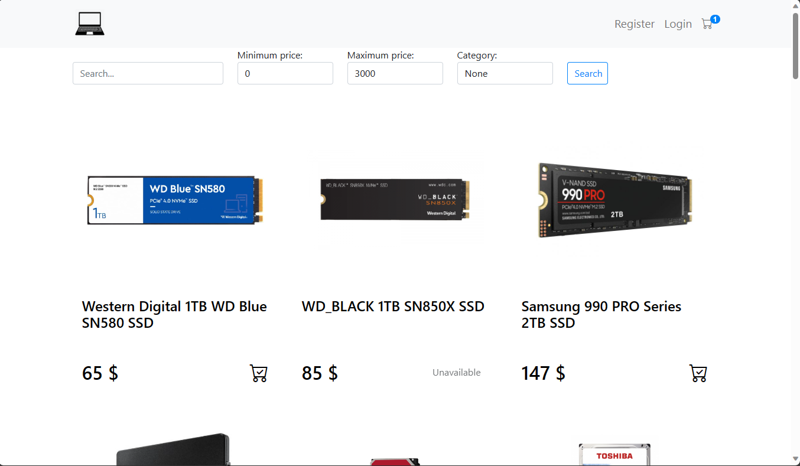
  </li>
  <li>
    
The details page contains accurate product data, including specifications like technical details and performance features. This page helps users make informed decisions before adding items to their cart.

    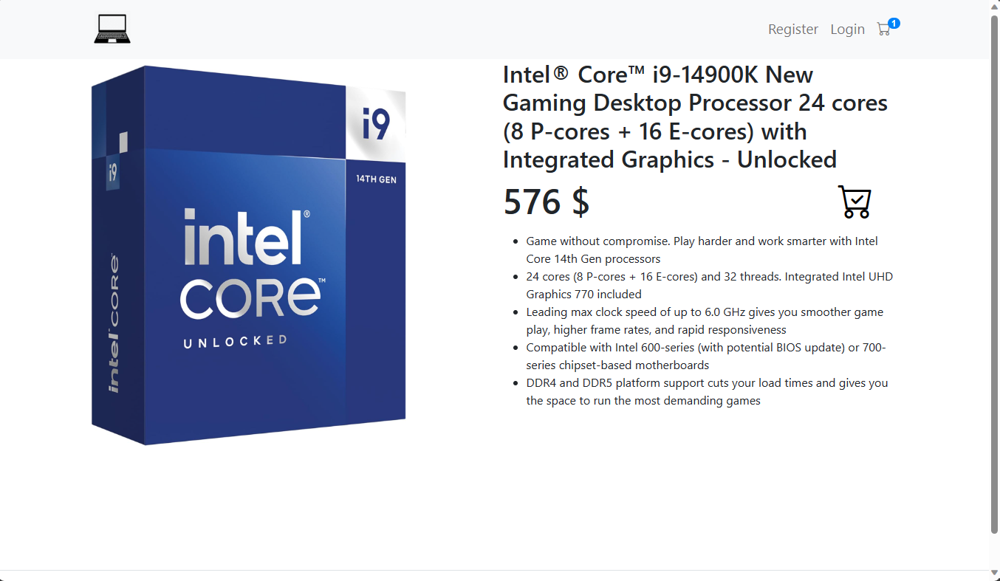
  </li>
  <li>
    
The shopping cart page shows all items added by the user. Users can review their selections and proceed to checkout. If the user is not logged in, they are prompted to either log in or create an account to complete the purchase.

    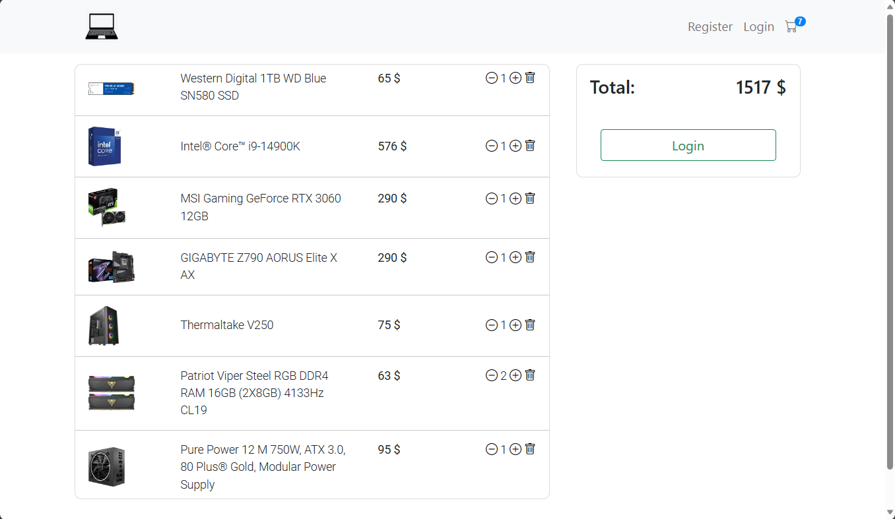
  </li>
  <li>
    
Before finalizing the purchase, users can review their order on the summary page. Here, they can change their shipping address, review the total price, and confirm the purchase.

    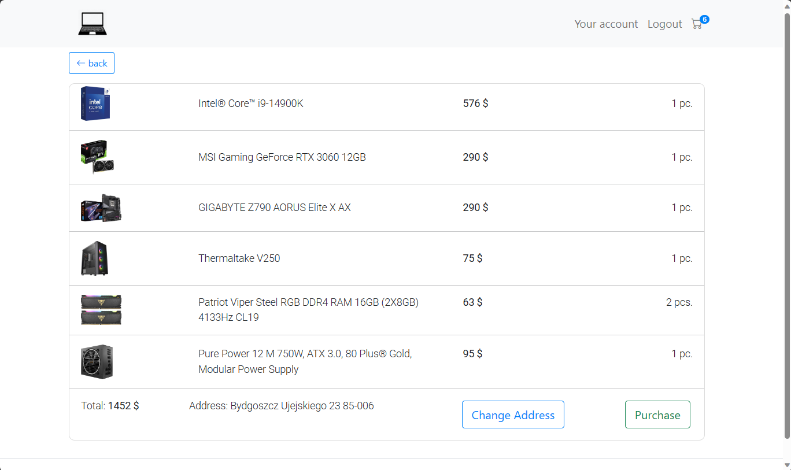
  </li>
  <li>
    
After completing a purchase, the user is redirected to a "Thank You" page, confirming that their order has been placed successfully.

    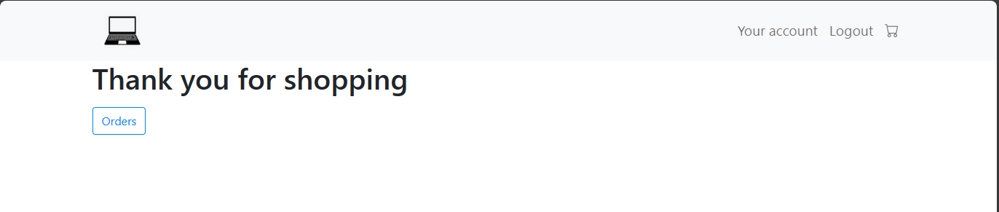
  </li>
  <li>
    
Purchased items are listed on the order page, where users can review their past purchases. Each order includes details such as item names, prices, and shipping address.

    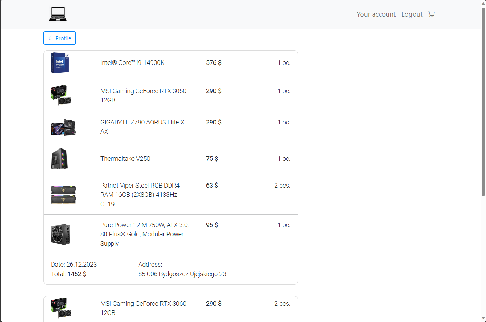
  </li>
  <li>
    
Users can create and manage their accounts. The account page allows users to update their personal information, review past orders, and track current purchases. An account is required to make any purchase..

    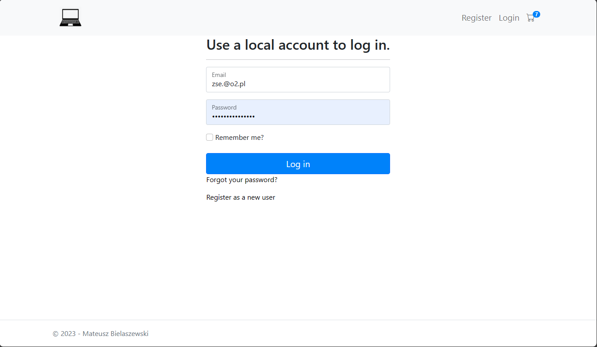
    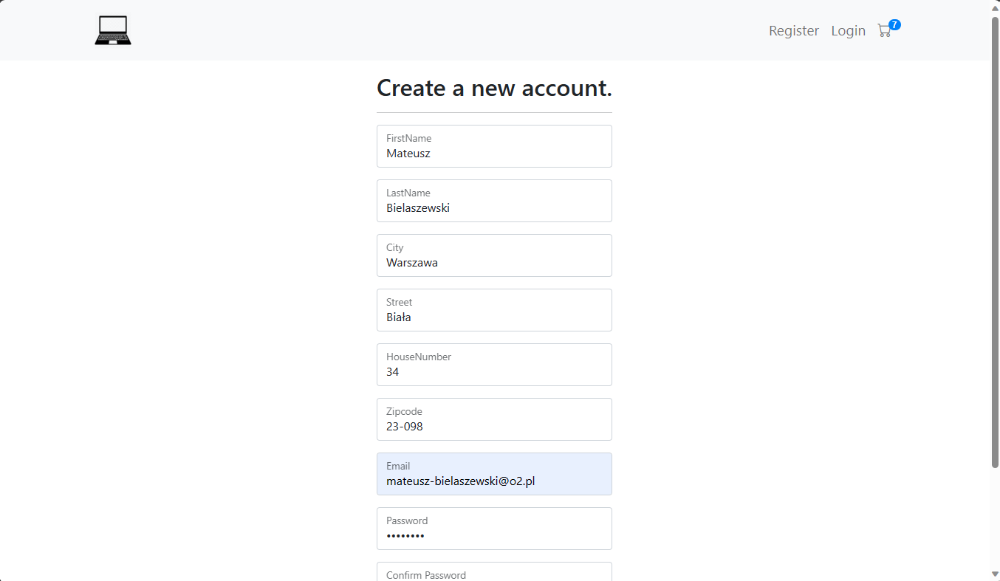
    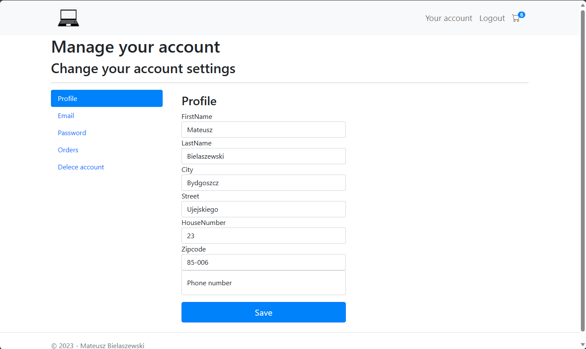
    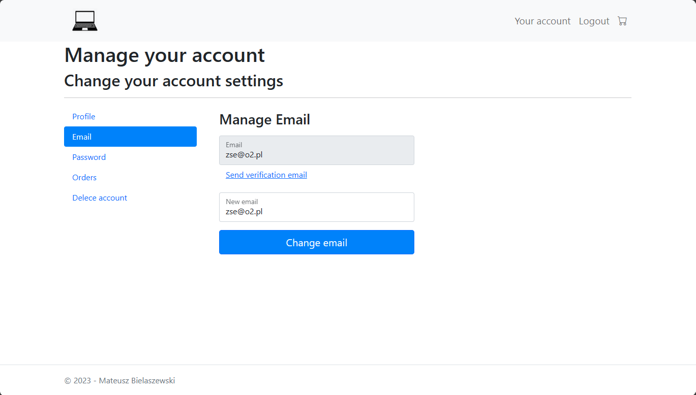
    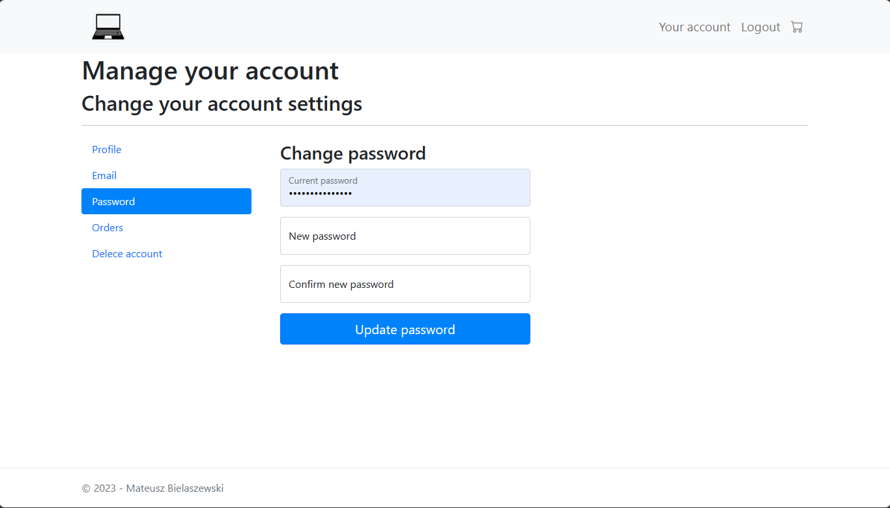
    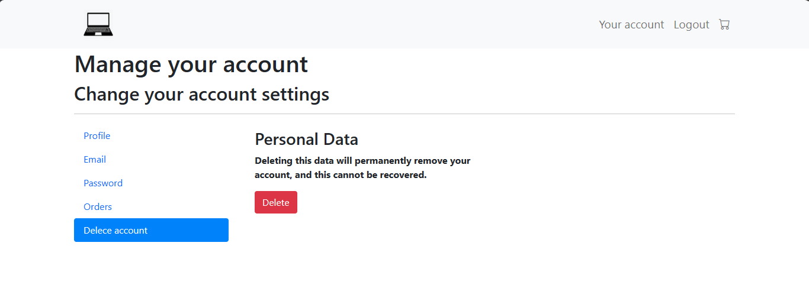
  </li>
</ul>

## How to install the Project
<ul>
  <li>Download Computer online store repository.</li>
  <li>Import backupDB2.bacpac file to MS SQL database.</li>
  <li>Open repository in Microsoft Visual Studio and set ConnectionStrings in appsettings.json file.</li>
</ul>
